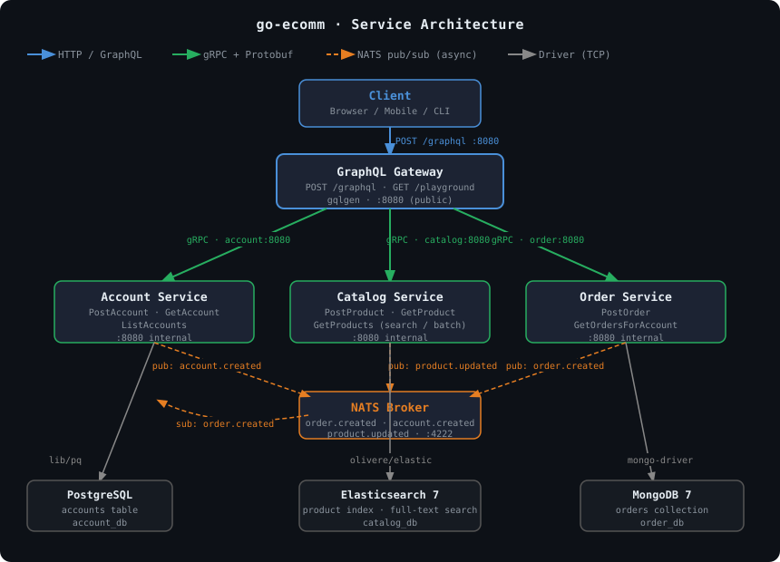

# Architecture & Service Communication



## Overview

go-ecomm is a microservices platform built around three principles:

- **Database per service** — each service owns its own storage technology, chosen to fit its workload.
- **Synchronous communication via gRPC** — the GraphQL gateway calls backend services using typed, generated gRPC clients.
- **Asynchronous communication via NATS** — services broadcast domain events to a NATS broker; other services subscribe as needed.

---

## Synchronous Communication (gRPC)

The GraphQL gateway is the only service that initiates synchronous calls. It holds one gRPC client per backend service and fans out calls based on the incoming GraphQL operation.

```
Client
  │  HTTP POST /graphql
  ▼
GraphQL Gateway
  ├── account.Client  ──gRPC──► Account Service  :8080
  ├── catalog.Client  ──gRPC──► Catalog Service  :8080
  └── order.Client    ──gRPC──► Order Service    :8080
```

### Service addresses (Docker Compose)

| Client env var | Value |
|----------------|-------|
| `ACCOUNT_SERVICE_URL` | `account:8080` |
| `CATALOG_SERVICE_URL` | `catalog:8080` |
| `ORDER_SERVICE_URL` | `order:8080` |

Backend services are **not** exposed on the host network. Only the GraphQL gateway's port 8080 is published.

### Protocol Buffers

Each service defines its RPC contract in a `.proto` file. Generated Go code is committed alongside the service. The gateway imports the generated client stubs directly (same Go module).

---

## Asynchronous Communication (NATS)

Services publish domain events to a NATS broker (`nats://nats:4222`). Events are JSON-encoded structs.

### Event subjects

| Subject | Publisher | Subscriber | Payload |
|---------|-----------|------------|---------|
| `order.created` | Order Service | Account Service | `{ id, account_id, total_price, created_at }` |
| `account.created` | Account Service | _(none yet)_ | `{ id, name }` |
| `product.updated` | Catalog Service | _(none yet)_ | `{ id, name, description, price }` |

### Publisher

```go
// events/events.go
type Publisher struct { nc *nats.Conn }

func (p *Publisher) Publish(subject string, v any) error
```

Events are marshaled to JSON and published to the given NATS subject. Each service creates a `Publisher` on startup; if NATS is unavailable the service still starts (event publishing is best-effort).

### Subscriber

```go
// events/events.go
func Subscribe[T any](nc *nats.Conn, subject string, handler func(T)) (*nats.Subscription, error)
```

A generic helper that deserialises incoming JSON into type `T` and calls `handler`. The Account Service subscribes to `order.created` on startup.

---

## Database Per Service

| Service | Database | Technology | Connection string env var |
|---------|----------|------------|--------------------------|
| Account | `account` (PostgreSQL) | Relational — simple user records | `DATABASE_URL` |
| Catalog | `product` index (Elasticsearch 7) | Full-text search — product catalog | `DATABASE_URL` |
| Order | `orders_db` (MongoDB 7) | Document store — nested order/product data | `DATABASE_URL` |

Each service retries its database connection on a 2-second interval at startup before accepting gRPC traffic.

### Schema details

**Account — PostgreSQL**
```sql
CREATE TABLE accounts (
    id   CHAR(27)     PRIMARY KEY,
    name VARCHAR(24)  NOT NULL
);
```

**Catalog — Elasticsearch index `product`**
```json
{
  "_id": "<ksuid>",
  "name": "string",
  "description": "string",
  "price": 0.0
}
```

**Order — MongoDB collection `orders`**
```json
{
  "_id": "<ksuid>",
  "created_at": "ISODate",
  "account_id": "<ksuid>",
  "total_price": 0.0,
  "products": [
    { "id": "<ksuid>", "name": "string", "description": "string", "price": 0.0, "quantity": 1 }
  ]
}
```

---

## Full System Diagram

```
┌──────────────────────────────────────────────────────────────────┐
│                         Docker Network                           │
│                                                                  │
│  Client ──HTTP:8080──► ┌─────────────────────────────────┐      │
│                         │        GraphQL Gateway          │      │
│                         │  POST /graphql  GET /playground │      │
│                         └──────┬──────────┬───────┬───────┘      │
│                          gRPC  │    gRPC  │  gRPC │              │
│                  ┌─────────────┘          │       └──────────┐   │
│                  │                        │                  │   │
│         ┌────────▼────────┐    ┌──────────▼──────┐  ┌───────▼──┐│
│         │ Account Service │    │ Catalog Service  │  │  Order   ││
│         │   :8080 gRPC    │    │   :8080 gRPC     │  │ Service  ││
│         └────────┬────────┘    └──────────┬───────┘  └────┬─────┘│
│                  │                        │               │      │
│           ┌──────▼──────┐    ┌────────────▼──────┐  ┌────▼────┐ │
│           │  PostgreSQL  │    │  Elasticsearch 7   │  │ MongoDB │ │
│           │  account_db  │    │    catalog_db      │  │ order_db│ │
│           └─────────────┘    └───────────────────┘  └─────────┘ │
│                  │                        │               │      │
│                  └────────────────────────┴───────────────┘      │
│                              publish events                       │
│                         ┌────────▼────────┐                      │
│                         │  NATS Broker    │                      │
│                         │  nats:4222      │                      │
│                         └─────────────────┘                      │
└──────────────────────────────────────────────────────────────────┘
```

---

## ID Generation

All domain entities use [KSUID](https://github.com/segmentio/ksuid) for IDs — 27-character, base-62 encoded, lexicographically sortable unique identifiers. KSUIDs embed a millisecond-resolution timestamp, so rows are naturally ordered by creation time without a separate `created_at` index on most queries.

---

## Configuration

All services follow the [12-factor app](https://12factor.net/) pattern. Configuration is read from environment variables at startup using `github.com/kelseyhightower/envconfig`.

Common variables:

| Variable | Used by | Description |
|----------|---------|-------------|
| `DATABASE_URL` | Account, Catalog, Order | Connection string for the service's database |
| `NATS_URL` | Account, Catalog, Order | NATS broker URL (e.g. `nats://nats:4222`) |
| `ACCOUNT_SERVICE_URL` | GraphQL | gRPC address of Account Service |
| `CATALOG_SERVICE_URL` | GraphQL | gRPC address of Catalog Service |
| `ORDER_SERVICE_URL` | GraphQL | gRPC address of Order Service |

---

## Request Lifecycle Example: `createOrder`

1. Client sends `POST /graphql` with the `createOrder` mutation.
2. GraphQL gateway parses the mutation and calls `mutationResolver.CreateOrder`.
3. Resolver calls `orderClient.PostOrder(ctx, accountID, products)` — a gRPC call to Order Service.
4. Order Service generates a KSUID, calculates `totalPrice`, persists the order to MongoDB.
5. Order Service publishes an `order.created` event to NATS.
6. Order Service returns the new `Order` to the GraphQL gateway via gRPC response.
7. GraphQL gateway maps the response to the GraphQL `Order` type and returns JSON to the client.
8. _(async)_ Account Service receives the `order.created` NATS event and processes it independently.
